# InvestApp — Инвестиционная платформа

Веб-приложение для отслеживания криптовалют, акций и управления инвестиционным портфелем.

## Стек технологий

- **Frontend**: HTML5, CSS3, Vue.js 3, Chart.js, Lightweight Charts
- **Backend/Auth/DB**: Supabase (PostgreSQL + Auth + RLS)
- **API**: Binance WebSocket, Finnhub, CryptoPanic
- **Email**: Resend SMTP
- **Тесты**: Jest, Cypress

## Структура проекта

```
frontend/
├── login.html / register.html / reset-password.html
├── crypto/
│   ├── cryptotracking.html       # Главная страница приложения
│   ├── api/                      # Работа с внешними API
│   ├── core/                     # Ядро: авторизация, профиль, настройки
│   ├── features/                 # Модули: дашборд, аналитика, торговля...
│   └── styles/                   # CSS-стили
├── admin/                        # Панель администратора
SQL/                              # Миграции базы данных
```

---

## Интерфейс приложения

### Авторизация

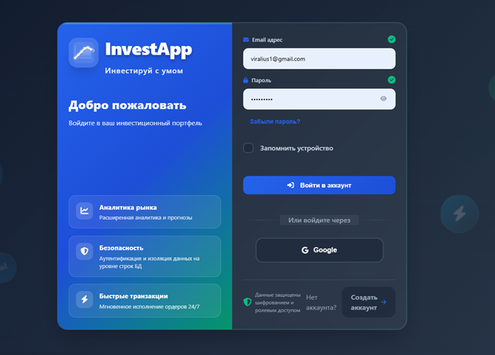

*Рисунок 1 — Страница авторизации*

---

### Регистрация

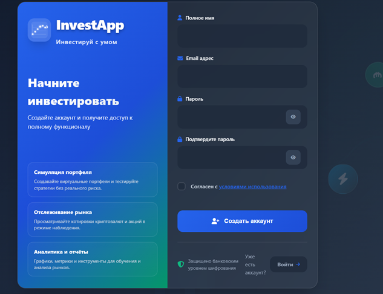

*Рисунок 2 — Страница регистрации*

---

### Главный дашборд

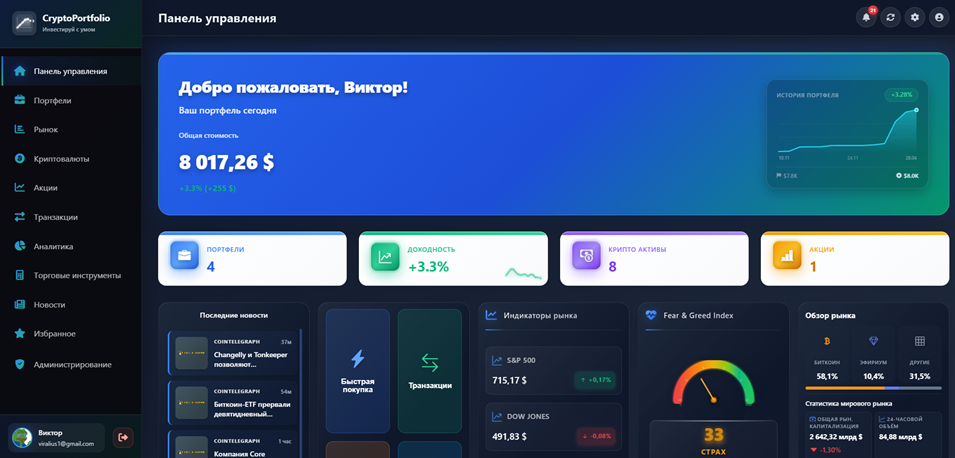

Четыре сводные карточки (портфели, доходность, крипто-активы, акции), виджеты рынка (S&P 500, Dow Jones, NASDAQ, Fear & Greed Index), графики динамики портфеля и блок избранных активов.

*Рисунок 3 — Главная панель управления (дашборд)*

---

### Портфели

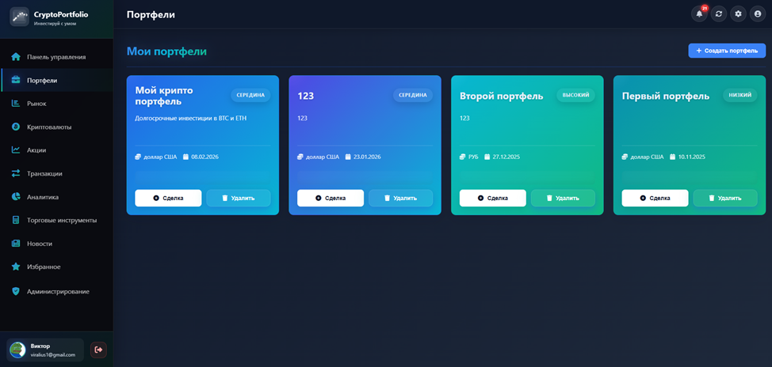

Карточки с наименованием, стоимостью и доходностью. Создание, редактирование и удаление с подтверждением.

*Рисунок 4 — Раздел «Портфели»*

---

### Транзакции

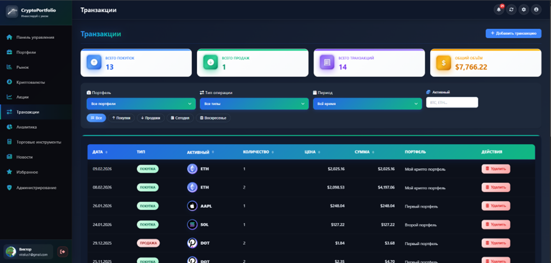

Агрегированные показатели (покупки/продажи/объём), фильтры по портфелю, типу, периоду и активу, таблица истории сделок.

*Рисунок 5 — Раздел «Транзакции»*

---

### Аналитика портфеля

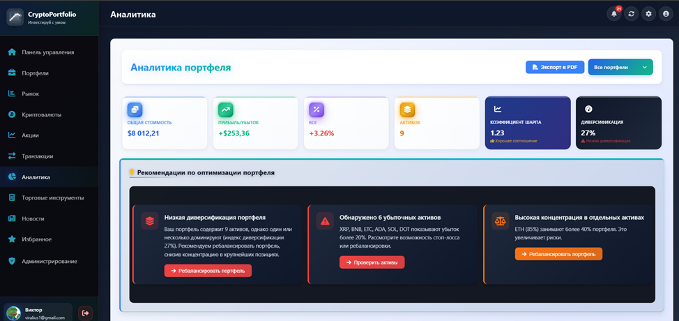

Показатели: общая стоимость, прибыль/убыток, ROI, коэффициент Шарпа, индекс Херфиндаля–Хиршмана. Автоматические рекомендации + шесть аналитических графиков.

*Рисунок 6 — Раздел «Аналитика портфеля»*

---

### Криптовалюты

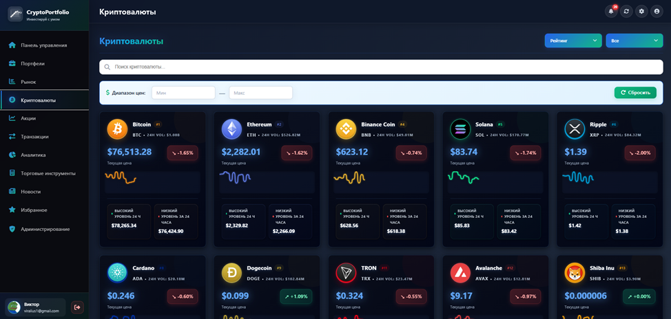

Карточки с логотипом, ценой, изменением за 24 ч и спарклайн-графиком за 7 дней. Сортировка, фильтрация по диапазону цен, поиск по тикеру.

*Рисунок 7 — Раздел «Криптовалюты»*

---

### Избранное

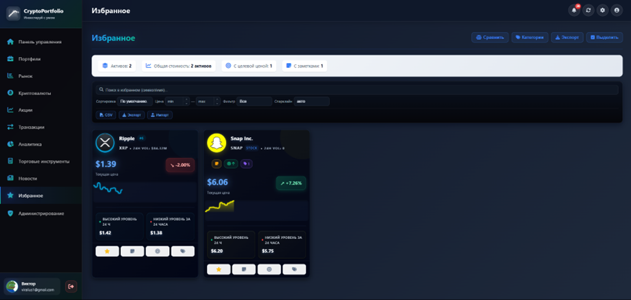

Целевые цены, заметки и категории для активов. Сравнение динамики нескольких активов на одном графике, экспорт данных.

*Рисунок 8 — Раздел «Избранное»*

---

### Новости

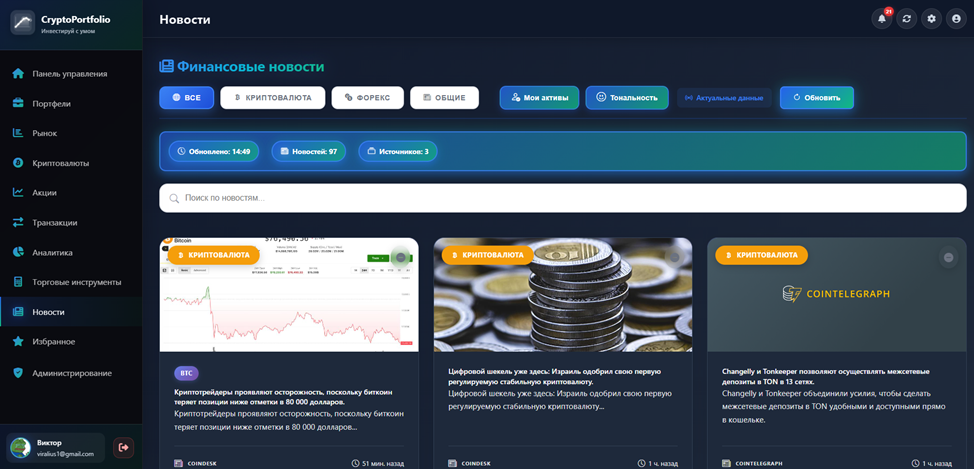

Лента из Finnhub и CryptoPanic. Фильтрация по категориям, режим персонализации (новости по активам портфеля), тональность материала.

*Рисунок 9 — Раздел «Новости»*

---

### Торговые инструменты

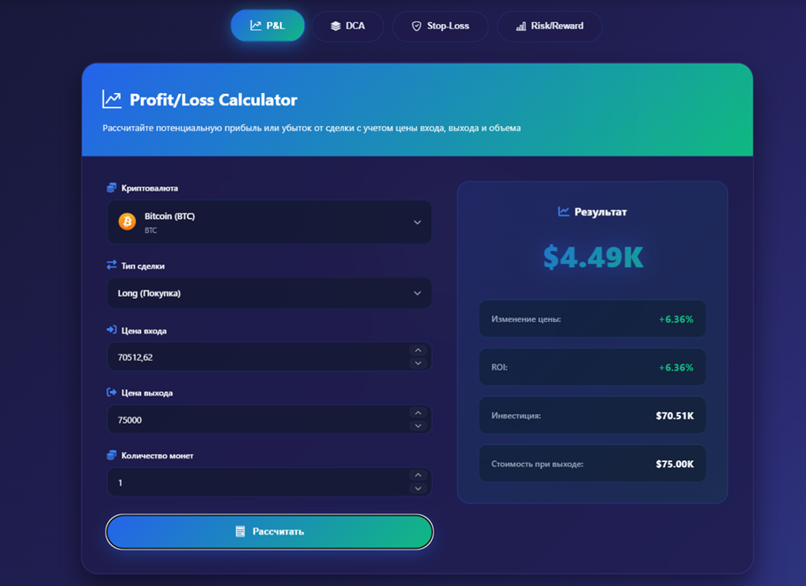

Калькулятор прибыли/убытка с комиссиями, калькулятор размера позиции, калькулятор средней цены, визуализатор stop-loss/take-profit с расчётом риск/прибыль.

*Рисунок 10 — Раздел «Торговые инструменты»*

---

### Уведомления и алерты

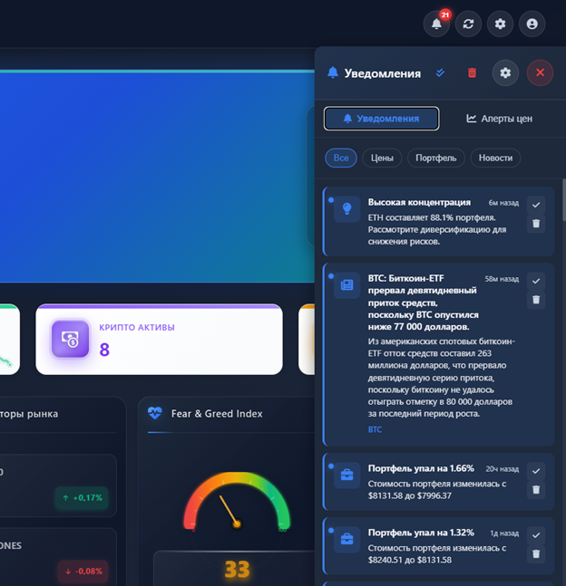

История оповещений с фильтрацией по типам. Ценовые алерты: push-уведомление при достижении заданного уровня.

*Рисунок 11 — Панель уведомлений и ценовые алерты*

---

### Модальное окно: создание портфеля

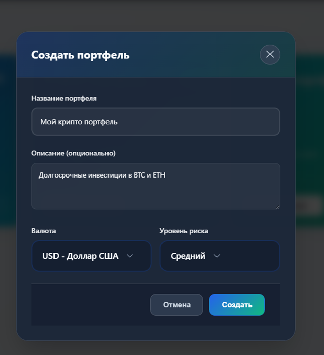

Поля: наименование, описание, базовая валюта (USD/EUR/RUB), уровень риска (низкий/средний/высокий).

*Рисунок 12 — Модальное окно «Создание портфеля»*

---

### Модальное окно: добавление транзакции

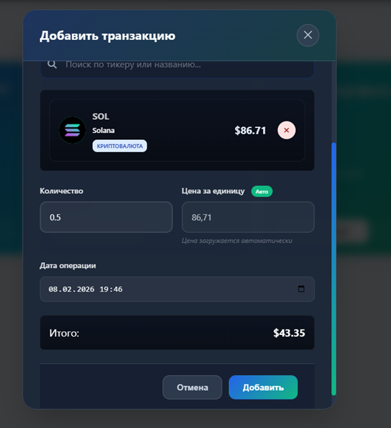

Тип операции, портфель, поиск актива с автодополнением, количество, цена (загружается автоматически), дата, итоговая сумма в реальном времени.

*Рисунок 13 — Модальное окно «Добавление транзакции»*

---

### Модальное окно: настройки

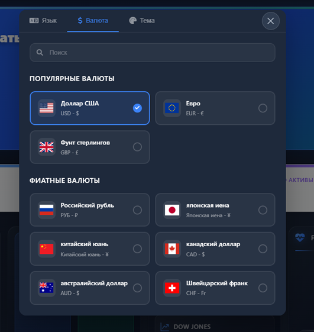

Три вкладки: язык интерфейса, базовая валюта, тема оформления. Изменения применяются без перезагрузки.

*Рисунок 14 — Модальное окно «Настройки»*

---

### Модальное окно: криптовалюта

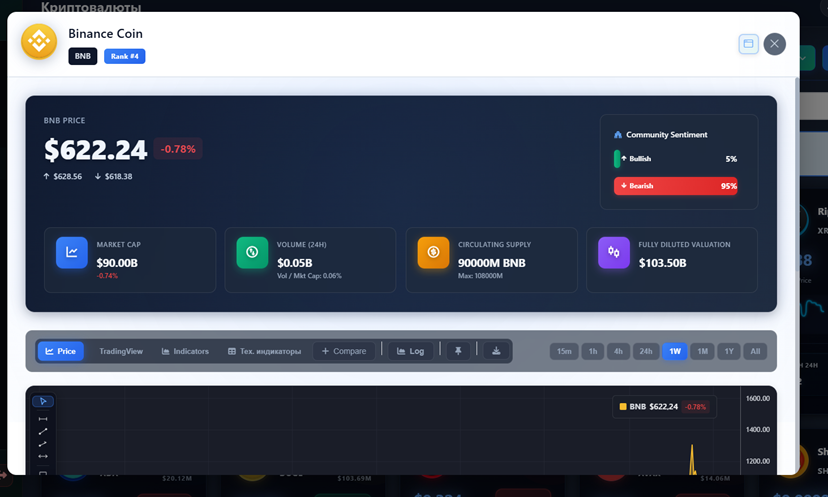

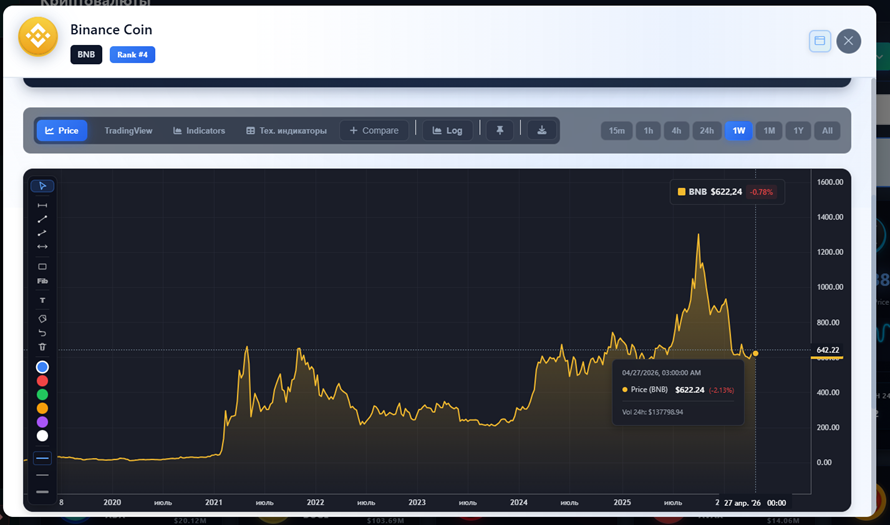

Цена, изменение за 24 ч, настроения сообщества, рыночная статистика, интерактивный график с типами отображения и временными периодами, панель разметки, добавление в портфель и избранное.

*Рисунок 15 — Детальная информация о криптовалюте*  
*Рисунок 16 — График в модальном окне*

---

### Модальное окно: акция

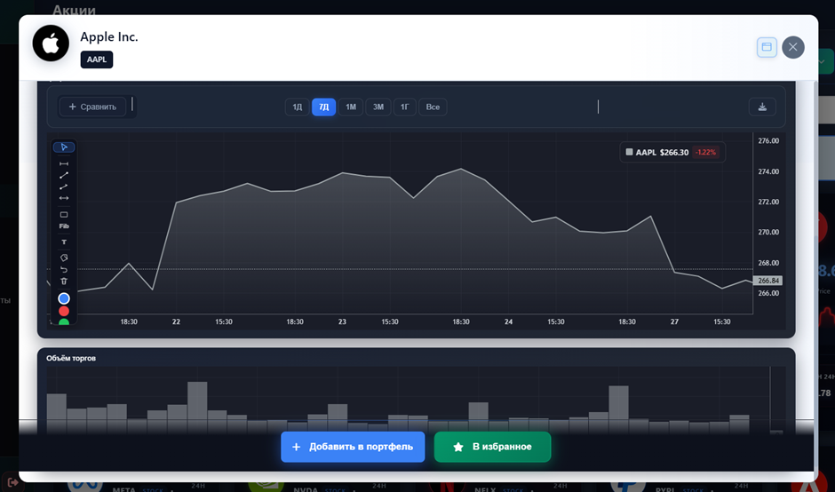

Цена, капитализация, P/E, объём, дивидендная доходность, ценовой график и график объёмов. Сравнение с другой акцией, скачивание графика в PNG/JPG.

*Рисунок 17 — Детальная информация об акции*

---

### Акции

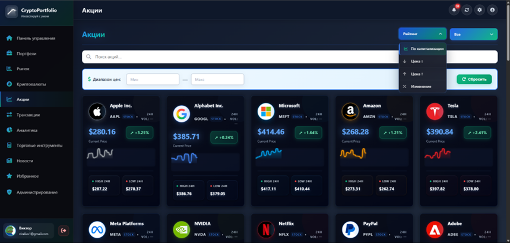

Карточки с тикером, наименованием, ценой и изменением за день. Сортировка по капитализации/цене/изменению, фильтрация по направлению движения, поиск.

*Рисунок 18 — Раздел «Акции»*

---

### Панель администратора

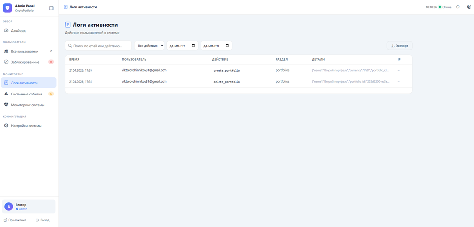

Доступна только пользователям с ролью `admin`. Управление пользователями (блокировка/разблокировка), логи активности с фильтрацией, системные настройки (интервал обновления, лимиты портфелей, пороги уведомлений).

*Рисунок 19 — Панель администратора*

---

### Восстановление пароля

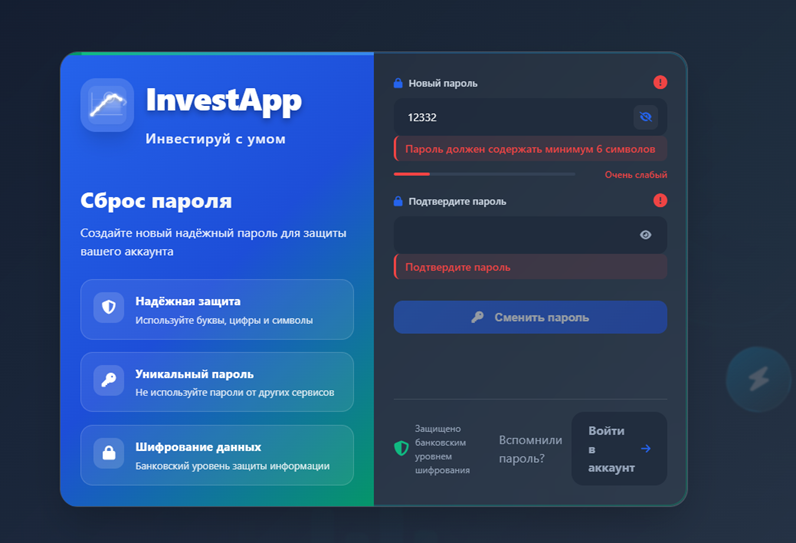

Ввод email → письмо со ссылкой через Supabase Auth. Валидация формата email, информационное сообщение об отправке.

*Рисунок 20 — Страница восстановления пароля*

---

## Запуск

1. Открыть `frontend/` через Live Server (VS Code)
2. Переменные Supabase заданы напрямую в JS-файлах (для дипломного проекта)

## База данных

SQL-миграции находятся в папке `SQL/`. Применять в Supabase SQL Editor в порядке нумерации файлов.
